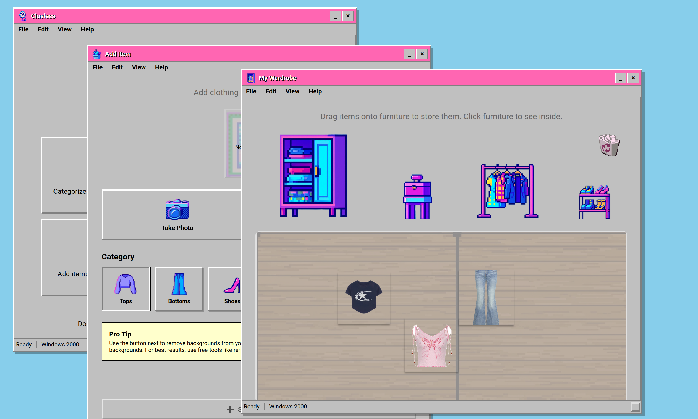

# Clueless - Windows 2000 Fashion Studio

<div align="center">


*As if! Your digital wardrobe just got a major makeover* 💅

**A retro-styled fashion organization app that brings Windows 2000 nostalgia to your closet management**

[](https://)
[](https://)
[](https://)

</div>

## What You Can Do Right Now

### 🏠 **Organize Your Digital Room**
**Drag and drop your clothes** into different furniture pieces:
- **Click the wardrobe** to store tops and dresses
- **Use the hanger rack** for hanging items  ( WILL HAVE HANGERS ONE DAY MAYBE)
- **Open the shoe shelf** for footwear
- **Access the jewelry box** for accessories
- **Leave items on the floor** for quick access

**Pro Tip**: Click items to resize them, long-press to take them out of furniture!

### 📸 **Add New Clothing Items**
**Two ways to add clothes:**
1. **Take photos** with your camera 📱
2. **Upload images** from your gallery 🖼️

**Smart features:**
- Automatic background removal (works only with solid colors, maybe one day will work properly)
- Categorize as tops, bottoms, dresses, shoes, accessories, or outerwear
- Items automatically appear in your room for organization

### 🎨 **Create Outfits on a Canvas**
**Build outfits visually:**
- **Drag items** from your wardrobe onto the canvas
- **Resize and position** each piece exactly how you want
- **Change background colors** to match your style
- **Save as images** to share your creations (or upload on pinterest diva)

**Perfect for**: Planning daily outfits or creating style inspiration boards!

### 👗 **Get Dressed with "Dress Me"**
**Browse your wardrobe category by category:**
- **Flip through tops, bottoms, and dresses** with arrow buttons
- **Switch between dress mode and top/bottom mode**
- **See real-time outfit combinations**
- **Favorite your best looks** with one click

**Great for**: Trying new combinations without the hassle!

### 🖼️ **Build Your Style Gallery**
**Manage all your saved outfits:**
- **Browse by categories**: Casual, Formal, Work, Party, Sport
- **Edit outfit names and categories** anytime
- **Delete outfits** you don't love anymore
- **View outfit details** and creation dates

**Your personal**: Fashion portfolio and style diary!

## 📸 See It In Action

<div align="center">

| Desktop View | My Wardrobe and Others |
|:------------:|:----------------:|
|  |  |

</div>

## 🚀 Get Started 

SOME FEATURES DONT WORK ON MOBILE AND THERES A LOT OF BUGS OKAY BUT ONE DAY IT WILL WORK (maybe) (if i got time)

### Installation
```bash
# Clone and setup
git clone https://github.com/wlaszkiewicz/clueless-app.git
cd clueless-app
npm install
```

### Launch the App

**For Mobile and Web (Expo):**
```bash
npm start
```

**For Desktop (Electron):**
```bash
npm run electron
```

## 🎮 Your First Fashion Session

### Step 1: Add Your First Item
1. **Double-click "Add Item"** on the desktop
2. **Choose "Take Photo"** or "Choose from Gallery"  
3. **Select a category** (like "Tops")
4. **Try background removal** for clean images
5. **Click "Save to Wardrobe"** - it appears in your room!

### Step 2: Organize Your Space
1. **Open "My Wardrobe"** to see your digital room
2. **Drag items from the floor** onto furniture
3. **Click the wardrobe** to see items inside
4. **Resize items** by clicking them and using +/- buttons

### Step 3: Create Your First Outfit
1. **Launch "Create Outfit"** 
2. **Pick items from your wardrobe** on the right
3. **Drag them onto the canvas** and arrange them
4. **Change the background** if you want
5. **Save as image** to keep your creation!

### Step 4: Try the "Dress Me" Feature
1. **Open "Dress Me"** 
2. **Browse through categories** using arrow buttons
3. **Switch to dress mode** if you prefer
4. **Click "Favorite"** when you love an outfit
5. **Check "Style Gallery"** to see all your saved outfits!


## 🚀 Future Possibilities

### WILL WORK

### Potential Enhancements
- [ ] AI-powered outfit suggestions
- [ ] Weather-based outfit recommendations  
- [ ] Social sharing features
- [ ] Advanced background removal with ML
- [ ] Outfit calendar and planning
- [ ] Clothing wear tracking

## 🙏 Acknowledgments

- **Windows 2000** for the iconic UI inspiration
- **Cher Horowitz** for the fashion inspiration (*As if!*)
- **The React Native community** for amazing tools
- **You** for reading this! 💖

---

<div align="center">

**Made with 💖 and 🎀 for fashion lovers everywhere**

*"She's a full-on Monet... It's like a painting, see? From far away, it's OK, but up close, it's a big old mess."* - But your wardrobe won't be! 

</div>
