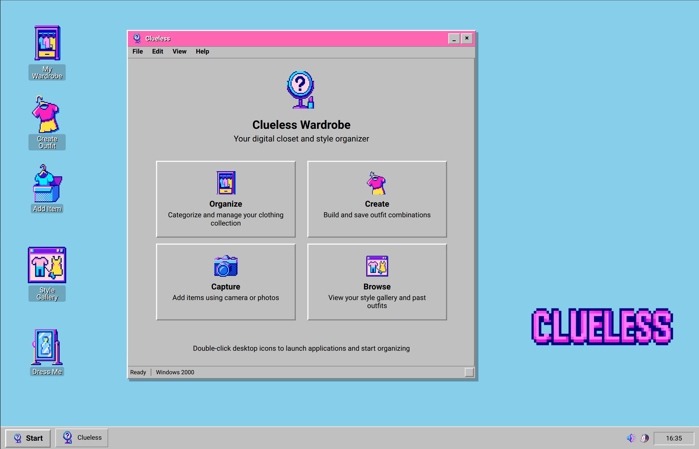
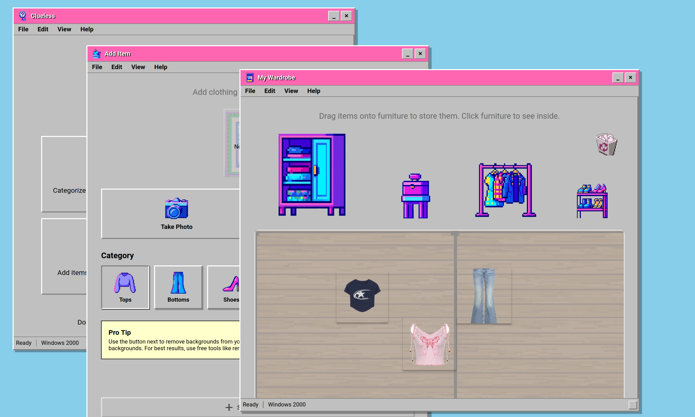
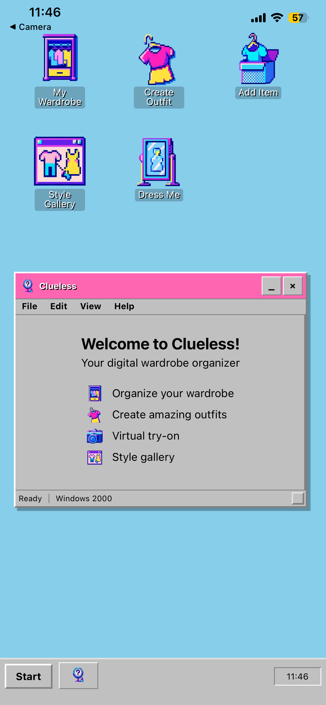
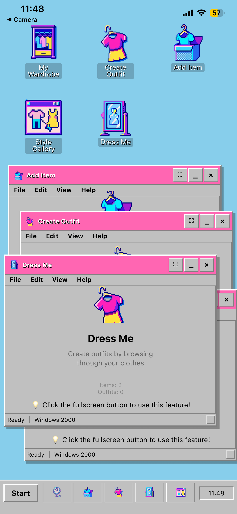
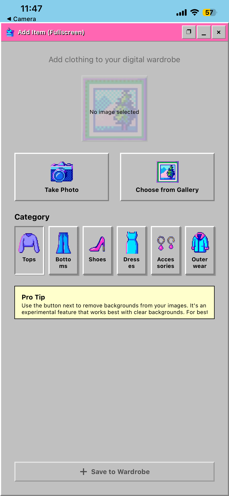

# Clueless - Windows 2000 Fashion Studio

<div align="center">


*As if! Your digital wardrobe just got a major makeover*

**A retro-styled fashion organization app that brings Windows 2000 nostalgia to your closet management**

[](https://)
[](https://)
[](https://)

</div>

## What You Can Do

**Windows 2000 Desktop Simulation** — fully interactive desktop environment: 
windows can be opened, minimized, and closed; desktop icons are draggable; 
the taskbar and Start menu open (some options are placeholders — it's a work in progress, as if!)

**Organize Your Digital Room** — drag and drop clothes into furniture: wardrobe, hanger rack, shoe shelf, jewelry box, or just leave them on the floor. Click items to resize, long-press to move them out of furniture.

**Add Clothing Items** — take a photo or upload from gallery. Automatic background removal (works best with solid colors). Items are categorized as tops, bottoms, dresses, shoes, accessories, or outerwear.

**Create Outfits on a Canvas** — drag items onto a canvas, resize and position them, change background colors, and save as an image to share or upload to Pinterest.

**Dress Me** — browse your wardrobe category by category with arrow buttons, switch between dress mode and top/bottom mode, and favorite your best combinations.

**Style Gallery** — manage all saved outfits by category (Casual, Formal, Work, Party, Sport), edit names, and view creation dates.

## Screenshots

<div align="center">

| Desktop View | My Wardrobe |
|:------------:|:----------------:|
|  |  |

</div>

[See all screenshots](docs/screenshots/)


## Mobile

The app is fully usable on mobile (with some bugs). Due to limited screen space, windows open in a compact preview mode showing what the window does and a fullscreen button. Tap fullscreen to use the full feature.

| Mobile Desktop | Preview | Fullscreen |
|:-------:|:-------:|:----------:|
| |  |  |


## Installation

```bash
git clone https://github.com/wlaszkiewicz/clueless-app.git
cd clueless-app
npm install
```

**Mobile and Web (Expo):**
```bash
npm start
```

**Desktop (Electron):**
```bash
npm run electron
```

> Some features are still a work in progress on mobile. One day I'll have the time, maybe.

## Tech Stack

React Native, TypeScript, Electron

## Future Plans

- [ ] AI-powered outfit suggestions
- [ ] Weather-based outfit recommendations
- [ ] Advanced background removal with ML
- [ ] Outfit calendar and planning
- [ ] Clothing wear tracking
- [ ] Hangers (one day, maybe, who knows)

## Acknowledgments

- Windows 2000 for the iconic UI inspiration
- Cher Horowitz for the fashion philosophy

---

<div align="center">

*"She's a full-on Monet... It's like a painting, see? From far away, it's OK, but up close, it's a big old mess."* — But your wardrobe won't be.

</div>
